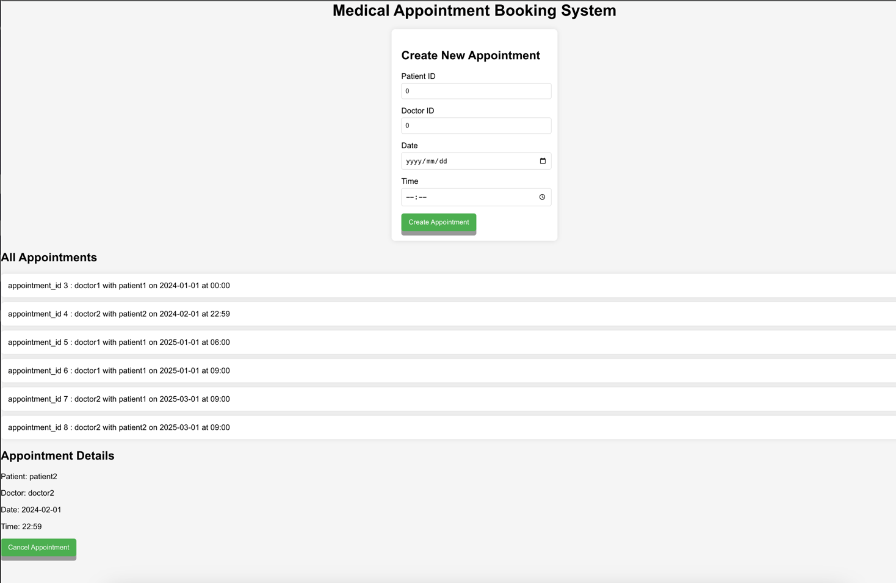

<h1 align="center">Medical_Appointment_Booking_System</h1>


## :sparkles: Skills
- `Springboot`
- `H2 database`
- `React`
## :book: How to use
To clone and run this application
```
# Clone this repository
$ git clone https://github.com/Reene444/Medical_Appointment_Booking_System.git
 
# Go into the repository
$ cd Appointment_booking_api

# Install dependencies
$ mvn clean package

# Run the app
$ java -jar target/appointment-system-api-0.0.1-SNAPSHOT.jar

# Read the swagger api document in the browser
$ link:localhost:8095/swagger-ui/index.html

# check the database in the browser
$ link:localhost:8095/db-console
/**
console information:
Diver class:org.h2.Driver
JDBC URL:jdbc:h2:file:./db/db
username:root
password:12345678
*/

# Go into the repository
$ cd my-react-app

# Run the app
$ npm start

//tips: the two apps run in the local, so the backend has configured the cors.
```
## SeedData

2 patients(id:1,2) and 2 doctors(id:3,4)
| ID  | AUTHORITIES | EMAIL           | NAME     | PASSWORD                                                               | ROLE   |
|-----|-------------|-----------------|----------|------------------------------------------------------------------------|--------|
| 1   | USER        | user@user.com   | patient1 | $2a$10$D9NkuAIbab95LzzjhGTEPek32tOawoq2KqyC7L64QThzxeW3CavDW           | PATIENT|
| 2   | USER        | user2@user.com  | patient2 | $2a$10$GHAUdHH/mC73D87y.fBV3O4u/69u8ysrK3bNqodigT3K5XzO5Y5Iu           | PATIENT|
| 3   | ADMIN USER  | admin@admin.com | doctor1  | $2a$10$04nVcDDDncE8p5qO0oRU3.voLExyG5Ybcg6nI7ZXg6RX3s87UGhke           | DOCTOR |
| 4   | ADMIN USER  | admin2@admin.com| doctor2  | $2a$10$9cpZIlaqhEeHPENiiOpYBukg8sFmBBmOIEa3R1hboZq/f9zPregjG           | DOCTOR |

(the password is encripted by RSA)


## Apis:


The backend started from the baseline project which means it included the authentication, the users(doctor and patient) need to be authenticated to access thess apis in the whole project,
but there we only implement the booking funciton, and could complete the user management functions in the later.

## The simple page
